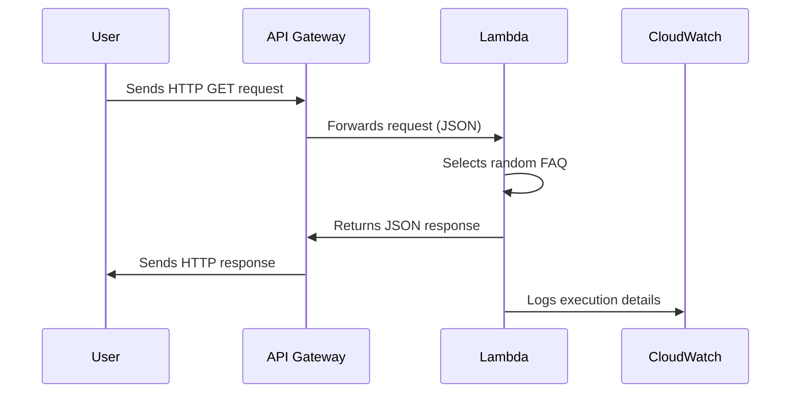

# Amazon API Gateway & Lambda FAQ Microservice

## Overview
Modern applications are moving toward serverless architectures and microservices. Instead of managing monolithic systems, applications are split into small, independent services that scale easily and are cost-efficient.

In this project, i built a serverless FAQ microservice that:
1. Accepts HTTP requests via Amazon API Gateway.
2. Invokes an AWS Lambda function.
3. Returns a random FAQ in JSON format.

This pattern forms the foundation of real-world cloud-native applications such as chatbots, customer support APIs, and IoT backends.


## Architecture



## Lab Objectives
By completing this project, i learned how to:
Create and deploy AWS Lambda functions.
Configure API Gateway REST endpoints.
Debug and monitor with Amazon CloudWatch.
Understand microservices, REST APIs, and JSON.

## Prerequisites
Basic programming knowledge.
Familiarity with AWS Console.
Understanding of APIs & JSON.

## Duration
Approx. 100 minutes, depending on AWS experience.

## AWS Services Used
Amazon API Gateway – Receives and routes API requests.
AWS Lambda – Runs microservice logic.
Amazon CloudWatch – Monitoring and debugging.
IAM – Access control and permissions.

## Project Setup

### Task 1: Create a Lambda Function
1. Go to AWS Console → Lambda → Create Function.
2. Choose Author from scratch.
3. Configure:
Function name: `FAQ`
Runtime: `Node.js 18.x`
Role: `lambda-basic-execution`
4. Create function.
#### Add Lambda Code
```javascript
var json = { 
  "questions": [
    { "q": "What is AWS Lambda?", "a": "AWS Lambda lets you run code without provisioning or managing servers..." },
    { "q": "What languages does AWS Lambda support?", "a": "Node.js, Python, Java, and more..." },
    { "q": "What is API Gateway?", "a": "A fully managed service for creating and maintaining APIs." }
  ] 
};

export const handler = function(event, context) { 
    var rand = Math.floor(Math.random() * json.questions.length); 
    var response = { body: JSON.stringify(json.questions[rand]) }; 
    context.succeed(response); 
};
```
Deploy the code.


### Task 2: Create API Gateway Endpoint
1. From Lambda, add a trigger.
2. Configure:
Source: `API Gateway`
API type: `REST`
Security: `Open` (lab only)
API name: `FAQ-API`
Stage: `myDeployment`
3. Save.

Now, every request to the endpoint invokes the Lambda.

### Task 3: Test the Service
Browser Test – Open the API endpoint URL → returns random FAQ.
Lambda Test – Create a test event `{}` in the Lambda console → check logs.

Example output:
```json
{
  "q": "What is AWS Lambda?",
  "a": "AWS Lambda lets you run code without provisioning or managing servers..."
}
```

### Task 4: Debug with CloudWatch
Navigate: Lambda → Monitor → CloudWatch Logs.
Logs show execution details, duration, memory, and errors.

## Deep Dive into Services

### Amazon API Gateway
Request/response transformation.
Security with IAM, Cognito, API Keys.
Stages (dev, test, prod).
CloudFront caching.

### AWS Lambda
Serverless compute with pay-per-use billing.
Triggers from 200+ AWS services.
Auto-scaling & IAM security.

### Amazon CloudWatch
Logs, metrics, dashboards.
Debugging API Gateway + Lambda.


## Extensions & Use Cases

Store FAQs in DynamoDB.
Add POST method for user-submitted FAQs.
Secure with IAM or Cognito authentication.
Deploy using Serverless Framework / AWS SAM.

### Enterprise Use Cases
Customer support APIs.
Product catalog microservices.
Real-time notifications.
IoT backends.
Chatbot integrations.

## Best Practices
Use clear REST endpoints (`/questions/1`).
Follow HTTP conventions (GET, POST, PUT, DELETE).
Implement error handling & status codes.
Enable CloudWatch logging.
Use authentication & authorization in production.
Version APIs (`/v1/questions`).

## Next Steps
Extend with DynamoDB storage.
Add authentication (IAM or Cognito).
Enable API Gateway caching/throttling.
Try WebSockets and private APIs.

## License
This project is part of an AWS hands-on lab. Educational use only.

Would you like me to also **add badges (build, license, AWS, etc.) and a "Quick Start Deployment" section with AWS CLI commands** to make it look even more like a professional GitHub project?
