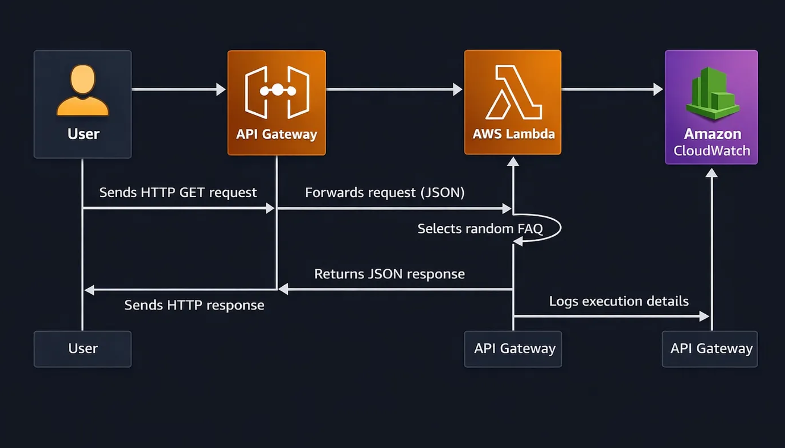
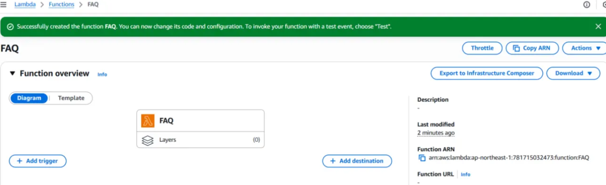
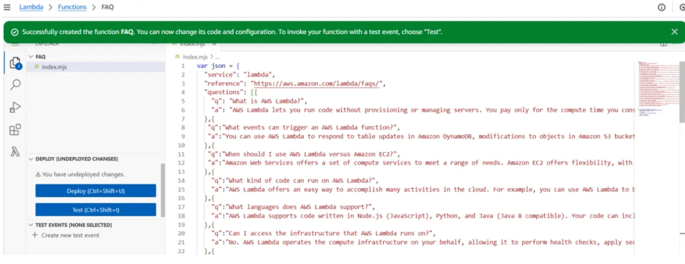
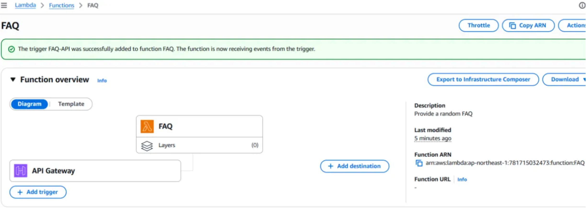
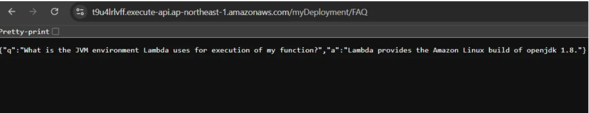
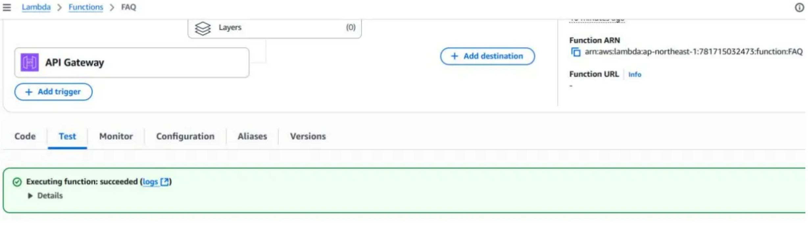
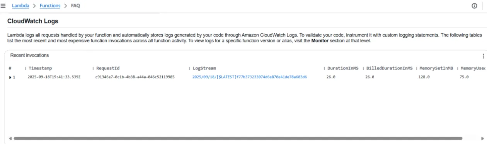
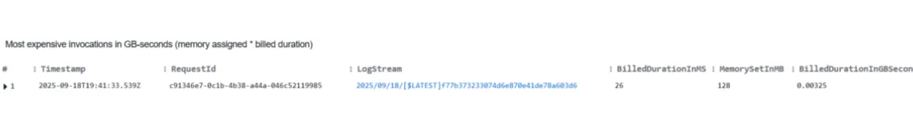

<div align="center">

# Building a Scalable FAQ Microservice

### with Amazon API Gateway, AWS Lambda, and Full Observability Using CloudWatch

[](https://aws.amazon.com/)
[](https://aws.amazon.com/lambda/)
[](https://aws.amazon.com/api-gateway/)
[](https://aws.amazon.com/cloudwatch/)
[](https://nodejs.org/)

A fully serverless FAQ microservice built to demonstrate request routing, event-driven compute, and end-to-end observability using core AWS building blocks.

</div>

<br>

<p align="center">
  
</p>

<p align="center"><sub><b>Figure 1.</b> End-to-end request lifecycle across API Gateway, Lambda, and CloudWatch.</sub></p>

---

## Table of Contents

- [Overview](#overview)
- [AWS Services Used](#aws-services-used)
- [How the Service Works](#how-the-service-works)
- [Prerequisites](#prerequisites)
- [Microservices Architecture](#microservices-architecture)
- [REST Framework](#rest-framework)
- [Walkthrough](#walkthrough)
  - [Step 1 - Create a Lambda Function](#step-1--create-a-lambda-function)
  - [Step 2 - Add the FAQ Code](#step-2--add-the-faq-code)
  - [Step 3 - Create an API Gateway Endpoint](#step-3--create-an-api-gateway-endpoint)
  - [Step 4 - Test the Lambda Function](#step-4--test-the-lambda-function)
  - [Step 5 - Debug with CloudWatch](#step-5--debug-with-cloudwatch)
- [Use Cases and Extensions](#use-cases-and-extensions)
- [Best Practices for RESTful APIs](#best-practices-for-restful-apis)
- [Author](#author)

---

## Overview

| | |
|---|---|
| **Pattern** | Serverless microservice |
| **Trigger** | HTTP `GET` via Amazon API Gateway |
| **Compute** | AWS Lambda (Node.js 18.x) |
| **Observability** | Amazon CloudWatch (logs, duration, GB-seconds) |
| **Response format** | JSON |
| **Estimated build time** | ~100 minutes |

Modern applications are increasingly built using serverless architectures and microservices. Instead of running one large, complex application, systems are broken into smaller services that are easier to manage, scale automatically, and reduce costs.

This project implements a **simple serverless FAQ microservice** that does the following:

- Receives HTTP requests through **Amazon API Gateway**
- Triggers an **AWS Lambda** function
- Returns an FAQ response in JSON format

This pattern is the basic building block of many real-world, cloud-native solutions, including:

- Chatbots
- Customer support and helpdesk APIs
- IoT and event-driven backends

By keeping each service small and focused, applications become more flexible, reliable, and easier to build and maintain. While the use case here is intentionally simple, the underlying skills are fundamental to real-world cloud development.

---

## AWS Services Used

### Amazon API Gateway

A managed service for creating, publishing, maintaining, and securing APIs.

**Key features:**
- Request and response transformation
- Access control with IAM
- API keys and usage plans
- CloudWatch integration for monitoring
- Caching with Amazon CloudFront
- Multiple stages (dev, test, prod)
- Custom domains

### AWS Lambda

AWS's serverless compute engine.

**Key features:**
- No servers to manage
- Pay-per-use billing
- Triggers from 200+ services
- Automatic scaling
- Security integration with IAM
- Logging and monitoring

### Amazon CloudWatch

Provides observability for AWS resources. In this project, it is used for:
- Lambda execution logs
- Debugging API Gateway integration
- Monitoring latency and errors

---

## How the Service Works

The service is a FAQ (Frequently Asked Questions) microservice. Whenever a user makes a request, it responds with a random question-and-answer pair stored in a JSON object.

1. **User sends a request**
   A user sends an HTTP `GET` request using a browser or an API tool (like Postman or curl) to an endpoint created with Amazon API Gateway.

2. **API Gateway receives the request**
   API Gateway is the first AWS service to handle the request. It converts the incoming HTTP request into JSON format and securely forwards it to AWS Lambda through a VPC endpoint.

3. **Lambda processes the request**
   The Lambda function runs automatically. Inside the function, a list of FAQs is stored as a JSON object, and the function randomly selects one question-and-answer pair.

4. **Response is generated**
   Lambda sends back the selected FAQ as a JSON response, which travels back through the VPC endpoint to API Gateway.

5. **User receives the result**
   API Gateway converts the JSON response back into an HTTP response, and the user sees a random FAQ displayed in their browser or API client.

6. **CloudWatch logs everything** for observability.

---

## Prerequisites

- Familiarity with basic programming concepts
- Basic knowledge of AWS Lambda
- Basic understanding of JSON and APIs

**Estimated duration:** ~100 minutes, depending on prior familiarity with the AWS Management Console.

**Key AWS services used:**
- **Amazon API Gateway** - receives and routes API requests
- **AWS Lambda** - processes the logic of the microservice
- **Amazon CloudWatch** - monitors and debugs logs
- **AWS IAM** - access control

---

## Microservices Architecture

Microservices architecture involves breaking an application into a set of small, independent services that communicate via lightweight APIs. Each microservice is responsible for one functionality and can be developed, deployed, and scaled independently.

In this project, the FAQ service is a microservice: a small, independent service that could be part of a larger system, such as a customer support portal.

**Benefits of microservices:**
- Easier scaling of specific components
- Independent deployments
- Technology flexibility (different services can use different languages or databases)
- Better fault isolation

Serverless computing allows developers to build and run applications without managing servers — AWS handles provisioning, scaling, and infrastructure management. With Lambda, you only pay for **execution time**, with no idle costs.

This FAQ microservice is entirely serverless: the API is hosted on API Gateway, the logic runs on Lambda, and monitoring happens via CloudWatch.

---

## REST Framework

Representational State Transfer (REST) is an architectural style for designing APIs. RESTful APIs follow principles such as:

| Principle | Description |
|---|---|
| **Client-server model** | Clients send requests; servers handle responses |
| **Statelessness** | Each request contains all needed information; no client state is stored server-side |
| **Uniform interface** | APIs follow consistent patterns, e.g. `GET /questions` |
| **Layered system** | APIs can be composed of multiple layers (client → API Gateway → Lambda) |

This FAQ service is a RESTful API with a **GET** method that returns a **JSON** response. JSON is a lightweight, human-readable, machine-friendly format widely used in APIs.

**Example JSON response:**

```json
{
  "q": "What is AWS Lambda?",
  "a": "AWS Lambda lets you run code without provisioning or managing servers..."
}
```

---

## Walkthrough

The sections below walk through provisioning the Lambda function, wiring it to API Gateway, testing it, and observing it in CloudWatch.

### Step 1 - Create a Lambda Function

1. In the AWS Console, search for **Lambda**.
2. Choose **Create function**.
3. Select **Author from scratch**.
4. Configure:
   - **Function name:** `FAQ`
   - **Runtime:** `Node.js 18.x`
   - **Execution role:** `lambda-basic-execution` (create an execution role)
   - Attach the function to the provided VPC, subnets, and security group.
5. Click **Create function**.

This step sets up the Lambda environment that will host the FAQ logic.

<p align="center">
  
</p>

<p align="center"><sub><b>Figure 2.</b> The <code>FAQ</code> Lambda function created successfully in the AWS Console.</sub></p>

---

### Step 2 - Add the FAQ Code

In the **Code** tab, replace the default code in `index.js` with the snippet below.

**Key features of the code:**
- Defines a JSON object containing FAQs
- Selects a random FAQ using `Math.random()`
- Returns the selected FAQ as a JSON response

**Minimal example:**

```javascript
var json = { "questions": [ {…}, {…}, {…} ] };

export const handler = function (event, context) {
  var rand = Math.floor(Math.random() * json.questions.length);
  var response = { body: JSON.stringify(json.questions[rand]) };
  context.succeed(response);
};
```

**Full sample code:**

```javascript
var json = {
  "service": "lambda",
  "reference": "https://aws.amazon.com/lambda/faqs/",
  "questions": [
    {
      "q": "What is AWS Lambda?",
      "a": "AWS Lambda lets you run code without provisioning or managing servers. You pay only for the compute time you consume."
    },
    {
      "q": "What events can trigger an AWS Lambda function?",
      "a": "AWS Lambda can be triggered by services such as Amazon API Gateway, Amazon S3, Amazon DynamoDB, and Amazon CloudWatch Events."
    },
    {
      "q": "When should I use AWS Lambda versus Amazon EC2?",
      "a": "AWS Lambda is ideal for event-driven and short-running tasks, while Amazon EC2 provides more control and is suitable for long-running or complex workloads."
    },
    {
      "q": "What kind of code can run on AWS Lambda?",
      "a": "AWS Lambda can run code for backend services, data processing, automation, and event handling in the cloud."
    },
    {
      "q": "What languages does AWS Lambda support?",
      "a": "AWS Lambda supports Node.js (JavaScript), Python, Java, Go, and other popular programming languages."
    },
    {
      "q": "Can I access the infrastructure that AWS Lambda runs on?",
      "a": "No. AWS manages the underlying infrastructure, including servers, scaling, and maintenance."
    },
    {
      "q": "What is Amazon API Gateway?",
      "a": "Amazon API Gateway is a fully managed service that allows you to create, publish, and manage APIs that securely connect applications to backend services."
    },
    {
      "q": "What is serverless computing?",
      "a": "Serverless computing lets you build and run applications without managing servers, while AWS automatically handles scaling and availability."
    },
    {
      "q": "What is Amazon CloudWatch?",
      "a": "Amazon CloudWatch is a monitoring service that provides logs, metrics, and alarms to help you observe application behavior and system health."
    },
    {
      "q": "How does API Gateway work with Lambda?",
      "a": "API Gateway receives HTTP requests and triggers Lambda functions, which process the request and return responses to users."
    },
    {
      "q": "What is a VPC endpoint?",
      "a": "A VPC endpoint enables private communication between AWS services within a VPC without using the public internet."
    },
    {
      "q": "What is JSON?",
      "a": "JSON is a lightweight data-interchange format used to exchange structured data between applications."
    },
    {
      "q": "What is observability in AWS?",
      "a": "Observability in AWS refers to monitoring applications using logs, metrics, and traces, commonly achieved with Amazon CloudWatch."
    },
    {
      "q": "Is AWS Lambda scalable?",
      "a": "Yes. AWS Lambda automatically scales in response to the number of incoming requests."
    },
    {
      "q": "What is an IAM role?",
      "a": "An IAM role is a set of permissions that allows AWS services to securely perform actions on your behalf."
    },
    {
      "q": "What are common use cases for AWS Lambda?",
      "a": "Common use cases include building APIs, processing files, automating tasks, handling IoT events, and running background jobs."
    }
  ]
};

export const handler = function (event, context) {
  var rand = Math.floor(Math.random() * json.questions.length);
  var response = { body: JSON.stringify(json.questions[rand]) };
  context.succeed(response);
};
```

After typing your code, click **Deploy**.

You now have a working Lambda function that returns a random FAQ when invoked.

<p align="center">
  
</p>

<p align="center"><sub><b>Figure 3.</b> The FAQ dataset and handler function deployed in <code>index.mjs</code>.</sub></p>

---

### Step 3 - Create an API Gateway Endpoint

1. In the Lambda function console, under **Function overview**, choose **Add trigger**.
2. Configure:
   - **Source:** API Gateway
   - **Intent:** Create a new API
   - **API type:** REST API
   - **API name:** `FAQ-API`
   - **Deployment stage:** `myDeployment`
3. Click **Add**.

This creates a new API Gateway REST endpoint that invokes the Lambda function whenever it receives a request.

<p align="center">
  
</p>

<p align="center"><sub><b>Figure 4.</b> The <code>FAQ-API</code> trigger successfully attached to the Lambda function, now receiving events.</sub></p>

---

### Step 4 - Test the Lambda Function

### Test via Browser

1. In **Triggers**, locate your API Gateway endpoint.
2. Copy the URL and paste it into a browser.
3. Refresh multiple times - each request returns a random FAQ.

**Example output:**

```json
{
  "q": "What is the JVM environment Lambda uses for execution of my function?",
  "a": "Lambda provides the Amazon Linux build of openjdk 1.8."
}
```

<p align="center">
  
</p>

<p align="center"><sub><b>Figure 5.</b> The live API Gateway endpoint returning a random FAQ as JSON in the browser.</sub></p>

### Test in Lambda Console

1. In the Lambda console, open the **Test** tab.
2. Create a test event named `BasicTest` with an empty JSON payload `{}`.
3. **Run** the test.
4. Check the execution result and logs.

This confirms the Lambda function works both in isolation and when triggered by API Gateway.

<p align="center">
  
</p>

<p align="center"><sub><b>Figure 6.</b> A successful test invocation in the Lambda console <b>Test</b> tab.</sub></p>

---

### Step 5 - Debug with CloudWatch

1. Go to the **Monitor** tab in Lambda.
2. Select **View logs in CloudWatch**.
3. Open a **log stream**.

**Example log entries:**

```
START RequestId: xxx Version: $LATEST
Quote selected: 4
Response: { body: "..." }
END RequestId: xxx
REPORT Duration: 3 ms  Billed Duration: 100 ms  Memory Size: 128 MB
```

CloudWatch provides detailed insights into execution times, resource usage, and errors.

<p align="center">
  
</p>

<p align="center"><sub><b>Figure 7.</b> Recent Lambda invocations in CloudWatch Logs, including duration, billed duration, and memory used.</sub></p>

You can also view the most expensive Lambda invocation based on GB-seconds, calculated from the memory allocated and the billed execution time.

**Example observation:**

| Metric | Value |
|---|---|
| Billed Duration | 26 ms |
| Memory Allocated | 128 MB |
| Cost Impact | 0.00325 GB-seconds |

<p align="center">
  
</p>

<p align="center"><sub><b>Figure 8.</b> The most expensive invocations measured in GB-seconds (memory assigned x billed duration).</sub></p>

This helps quickly identify which Lambda executions cost the most, so you can optimize them by reducing execution time or right-sizing memory.

There are many more observations that can be made in CloudWatch, but to keep this walkthrough focused, these should suffice.

---

## Use Cases and Extensions

While this project creates a simple FAQ service, the same pattern can be extended.

**Potential extensions:**
- Store FAQs in Amazon DynamoDB instead of hardcoding
- Add authentication with IAM or Cognito
- Add a `POST` method to let users contribute FAQs
- Add versioning via multiple stages (dev, prod)
- Deploy with frameworks like the Serverless Framework or AWS SAM

**Enterprise use cases:**
- Customer support APIs
- Product catalogs
- Real-time notification services
- IoT backends
- Chatbot integrations

---

## Best Practices for RESTful APIs

- Use clear and consistent endpoints (e.g., `/questions/17`)
- Follow HTTP method conventions (`GET`, `POST`, `PUT`, `DELETE`)
- Implement error handling with meaningful status codes
- Use versioning (e.g., `/v1/questions`)
- Secure APIs with IAM, Cognito, or API keys
- Enable CloudWatch logging and metrics

---

## Author

<div align="center">

**Roland Mawuli Awuku**

Cloud and security professional focused on building secure, scalable, and production-ready systems on AWS (5x AWS Certified).

[](https://medium.com/@awukurolandmawuli)

</div>

---

<p align="center"><sub>Originally published on <a href="https://medium.com/@awukurolandmawuli/building-a-scalable-faq-microservice-with-amazon-api-gateway-aws-lambda-and-full-observability-6b72710f0389">Medium</a>.</sub></p>
